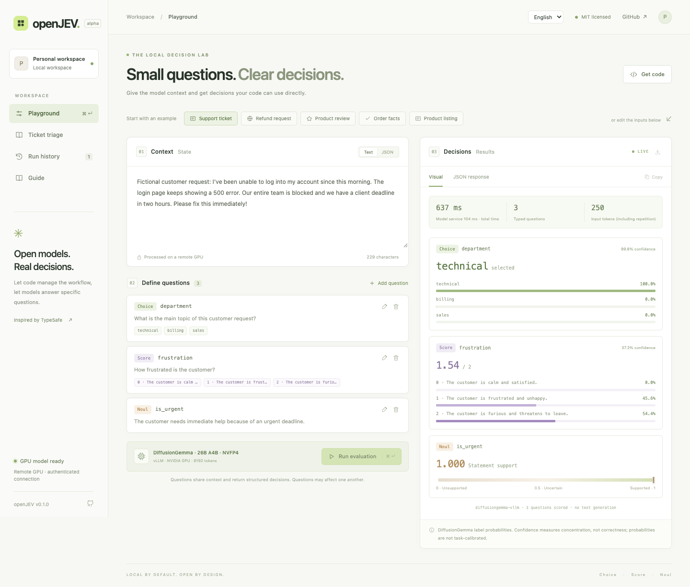
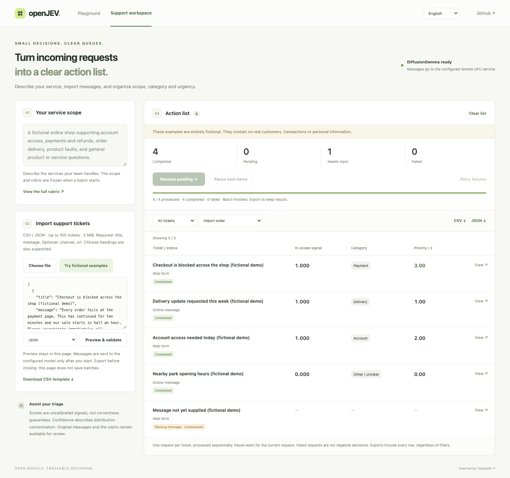

# openJEV

**Small questions. Clear decisions.**

A self-hosted playground and reproducible recipe for typed AI decisions: send context and questions, receive choices, scores, and probability distributions. Try a small CPU model, or run DiffusionGemma on your own GPU server.

The GPU route uses [razorback16/openjev](https://github.com/razorback16/openjev) as its model-serving backend. This repository adds a visual playground, a bilingual batch ticket workspace, a CPU MiniLM route, bounded text generation, and reproducible deployment/evaluation tools. We have not trained a new DiffusionGemma model or established a model-quality improvement over that upstream server. See [the project comparison](docs/upstream-comparison.md).

Independent of TypeSafe. This project does **not** contain Jev's weights or training method, and does not claim matching accuracy, calibration, latency, or SDK compatibility. The repository is currently private while the recipe is prepared for release.



## Choose a route

| Route | What you need | What it gives you |
|---|---|---|
| CPU quickstart | Python 3.10+; recommended 3.12 | Multilingual MiniLM INT8, about 107 MB of weights; short-text classification |
| GPU recipe | Linux x86_64, Docker with NVIDIA support; tested model configuration on one H100 80GB | DiffusionGemma 26B-A4B NVFP4, typed reads and bounded text generation, 8192-token service window |
| Existing Kev service | A separately installed Kev server | Optional HTTP adapter; adapter tested, Kev weights not evaluated here |

## Try it on your laptop

```bash
git clone git@github.com:zoedsy/openJEV.git
cd openJEV
./run.sh
```

While the repository is private, cloning requires repository access. Python dependencies and model weights download on first launch. Open **http://127.0.0.1:8766**. No model API key is required.

The playground defaults to **English**, with an **English / 简体中文** language switch. It includes fictional customer support, product feedback, fact-checking and product-listing examples. The selected language is shared across both pages; changing it does not translate or overwrite a custom input or a completed result.

For a batch, open **http://127.0.0.1:8766/tickets**. Define a service scope and import CSV/JSON messages; classify the request, check whether it is in scope, and prioritize by explicit urgency. Pause/resume, filter/sort, and export every record with its exact input and raw result. Missing messages stay unscored. Start with five clearly marked fictional demo tickets. See the [ticket workspace guide](docs/tickets.md).



For other applications, see [use cases and example questions](docs/use-cases.md): feedback classification, product data checks, intake validation and content labeling.

```bash
# Once MiniLM has downloaded, run without network model downloads.
OPENJEV_OFFLINE=1 ./run.sh
```

## Run DiffusionGemma on a GPU

On your GPU server, from the repository root:

```bash
docker compose -f deploy/gpu/compose.yaml up -d
docker compose -f deploy/gpu/compose.yaml logs -f model
```

The recipe pins the image digest and model revision, downloads the weights, loads the model, and runs a three-type smoke request before reporting `ready`. The API binds to the GPU host's loopback address. Keep the model running while using the playground.

On your laptop, keep an SSH tunnel open:

```bash
ssh -N -o ExitOnForwardFailure=yes -L 8008:127.0.0.1:8008 user@gpu-host
```

Then, in another local terminal:

```bash
./run-gpu.sh
```

If everything runs on the same machine, skip the tunnel. See the **[complete GPU recipe](docs/diffusiongemma.md)** for prerequisites, pinned versions, readiness, storage, stopping, and troubleshooting. This uses NVIDIA's **NVFP4 checkpoint**, not BF16 weights.

## Use the API

```bash
curl http://127.0.0.1:8766/v1/systemone \
  -H 'Content-Type: application/json' \
  -d '{
    "state": "My headphones are broken. Please refund my money.",
    "questions": {
      "intent": {
        "type": "choice",
        "instructions": "What does the customer want?",
        "criteria": {"refund": "Return money", "buy": "Buy a new item"}
      },
      "broken": {"type": "noul", "instructions": "The headphones are broken."},
      "urgency": {
        "type": "score",
        "instructions": "Rate urgency based on the stated deadline.",
        "criteria": ["No deadline", "This week", "Within one hour"]
      }
    }
  }'
```

| Primitive | Result |
|---|---|
| `choice` | One supplied option and its probability distribution |
| `score` | Expected level, numbered from zero, plus the level distribution |
| `noul` | A value between zero and one for a proposition |

`GET /api/capabilities` reports implemented and currently available features with their limits. `GET /api/status` reports the backend and readiness. `GET /v1/models` lists model names. `examples/client.py` is a standard-library Python client. The UI exports Python, JavaScript, and cURL examples for the current input.

The DiffusionGemma adapter also exposes a text-only, non-streaming `POST /v1/chat/completions` subset, with a 512-token output cap. Try `python3 examples/chat_client.py --prompt "Summarize: the customer requests a replacement for a damaged parcel."`. Unsupported controls fail explicitly; see the [API guide](docs/api.md). CPU MiniLM does not generate text.

The decision API is a TypeSafe-style **subset**. Accepted model aliases do not call Jev. Response metadata identifies the actual model. `confidence = 1 − H(p)/log(n)` measures concentration, **not correctness**. Current probabilities are uncalibrated on user tasks.

## Measure before claiming

With the playground API running:

```bash
python3 scripts/benchmark.py --example support --repeat 10
python3 scripts/evaluate.py --data eval/smoke.jsonl
```

The first script reports client p50/p95 latency with warm-up separated. The second calculates accuracy, NLL, Brier score, ECE, score error and per-slice metrics, retaining failed and unlabeled cases. Its two synthetic fixtures only check the evaluation pipeline; they are **not a quality benchmark**. Measurements and outputs stay in ignored `artifacts/`.

For saved predictions, [offline temperature fitting and held-out comparison](docs/evaluation.md) check model identity and calibration/test separation. The bundled synthetic calibration/test sets demonstrate the workflow only; calibration is never silently enabled on the API.

Read the **[evaluation and improvement recipe](docs/recipe.md)** and **[validation record](docs/validation.md)**. There is no paired Jev benchmark or implemented RLCD training pipeline in this repository.

## Boundaries

- MiniLM evaluates each candidate independently; more questions require more computation. Each context/hypothesis pair is limited to 512 tokens.
- DiffusionGemma reads label probabilities through [razorback16/openjev](https://github.com/razorback16/openjev). Questions share a canvas and can influence each other. It does not reproduce Jev's question-isolation claim.
- Maximum 32 questions and 256 candidate evaluations per request; DiffusionGemma Choice has at most 128 options. The 8192-token GPU window includes internal prompts. Oversized requests fail explicitly.
- Typed decisions return structured answers without generating prose. DiffusionGemma text generation is a separate endpoint and requires more model work. A correct schema does not establish correct reasoning.
- The local API accepts at most 256 KiB per request and two active requests; extra requests receive 429. The optional stdio relay serializes requests over one persistent connection and reconnects for a subsequent request after failure, without replaying an uncertain request.
- The single-request playground stores the last 20 runs in browser local history; clear them in the UI. The ticket workspace keeps its batch only in page memory, so export before refreshing. The server does not persist request bodies by default. On first use of this version, the old `openjev.runs.v1` demo history is cleared; unrelated browser data is preserved.
- The playground binds to loopback. `OPENJEV_API_KEY` can protect `/v1` endpoints. A public multi-user service needs its own authentication, rate limiting, and deployment design.

## Development

```bash
python3 -m venv .venv
source .venv/bin/activate
pip install -e '.[dev]'
python -m pytest -q -m 'not model'
# Optional: downloaded MiniLM weights required.
OPENJEV_TEST_MODEL=1 OPENJEV_OFFLINE=1 python -m pytest -q -m model
```

`requirements.lock.txt` records the tested Python 3.12 / Apple Silicon environment; it is not a GPU-runtime lock. The GPU recipe pins its own image. CI runs Python contract/transport tests and ticket-workspace and playground browser tests without GPU weights.

Optional local browser checks (Node.js 22+):

```bash
npm install --no-save --package-lock=false playwright@1.62.1
npx playwright install chromium
node --test tests/tickets.test.cjs tests/tickets-browser.test.cjs tests/playground-browser.test.cjs
```

The browser tests use explicitly synthetic HTTP fixtures; real-model checks are recorded separately.

- [Backend settings](docs/backends.md)
- [Open alternatives and training approaches](docs/alternatives.md)
- [Contributing](CONTRIBUTING.md)
- [Model and dependency attribution](THIRD_PARTY.md)

## Acknowledgements

Thanks to Google DeepMind for DiffusionGemma, NVIDIA for the NVFP4 checkpoint, the upstream OpenJev and vLLM contributors for the model-serving implementation, and TypeSafe AI for Jev's public documentation and typed-decision interface. The CPU quickstart also builds on multilingual MiniLM and the ONNX Community's conversion.

See [ACKNOWLEDGEMENTS.md](ACKNOWLEDGEMENTS.md) for contribution-specific credits and source links.

## Attribution and license

Our playground, API adapter, and recipe code are [MIT licensed](LICENSE). DiffusionGemma serving uses the separately distributed [razorback16/openjev](https://github.com/razorback16/openjev) project and NVIDIA checkpoint; this repository does not redistribute their weights or claim authorship of their model implementation. Model terms remain separate from this repository's license; see [THIRD_PARTY.md](THIRD_PARTY.md).

The interface is inspired by TypeSafe's [public primitives](https://docs.typesafe.ai/primitives). openJEV is not affiliated with TypeSafe or with other projects using the same name.
