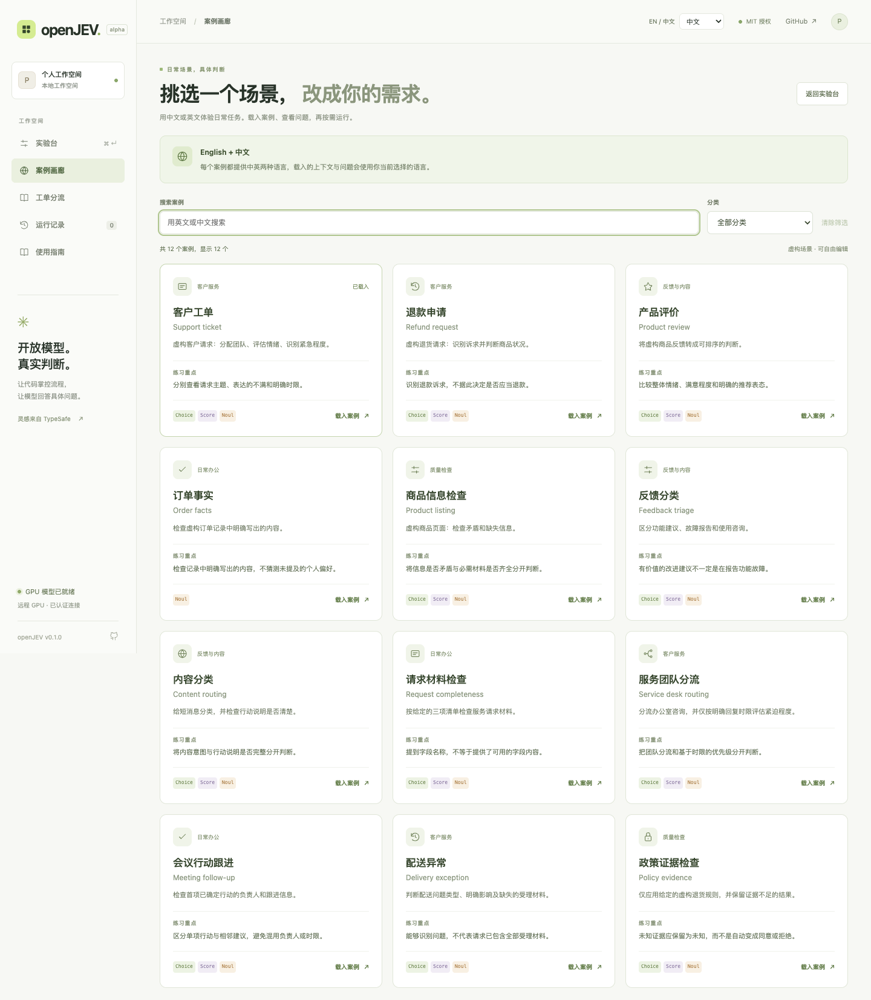

[English](README.md) | **简体中文**

# openJEV

**把具体问题，变成代码可直接使用的判断。**

openJEV 提供可自行部署的双语 Playground 和部署、评测 recipe。输入一份上下文，定义有限选项或评分标准，返回类别、分数及概率分布。可以先在笔记本上体验小型 CPU 模型，也可以在自己的 GPU 服务器运行 DiffusionGemma。

GPU 推理由 [razorback16/openjev](https://github.com/razorback16/openjev) 提供。这个仓库增加可视化编辑器、双语工单工作台、CPU MiniLM 路径、受限的文本生成接口，以及部署与评测工具。我们没有重新训练 DiffusionGemma，也没有证明模型质量优于该上游项目。详见[项目对照](docs/upstream-comparison.md)。

这是独立项目，不包含 Jev 的权重或私有训练方法；不宣称达到它的准确率、校准水平、延迟或完整 SDK 兼容性。**仓库目前仍为 private**，正在整理供后续发布的 recipe。


## 在笔记本上试玩

需要 Python 3.10 或更新版本，推荐 3.12：

```bash
git clone git@github.com:zoedsy/openJEV.git
cd openJEV
./run.sh
```

私有阶段需要仓库访问权限。首次启动会安装依赖并下载约 107 MB 的 MiniLM 权重；不需要购买模型 API key。打开 [Playground](http://127.0.0.1:8766/)。模型下载完成后，可以用 `OPENJEV_OFFLINE=1 ./run.sh` 避免再次联网下载权重。

页面默认英文，右上角可切换 **English / 简体中文**（`en` / `zh`），两个工作台共享语言偏好。语言切换不会翻译或覆盖你自行填写的输入，也不会修改已经完成的结果。

## 从双语示例开始

打开[示例画廊](http://127.0.0.1:8766/?view=examples)，选择任意卡片，一键载入 Playground，再点击运行。每张卡片始终同时显示中英文标题；说明、分类和使用提示按当前界面语言显示。主页面保留前 5 个快捷示例。

画廊包含 **12 个纯虚构的通用场景**：客户工单、退款申请、产品评价、订单事实、商品信息检查，以及反馈分类、内容分类、请求材料检查、服务团队分流、会议行动跟进、配送异常和政策证据检查。前 5 个已有场景与新增 7 个场景均不包含真实客户记录或个人工作内容；示例不会预先填入模型答案。

[场景表与判断边界](docs/use-cases.md#zh-cn)列出每个示例的直达链接、可判断的问题，以及输入没有提供时应保留的未知信息。示例用于体验工作流程，不构成准确率评测。



## 批量处理客服工单

打开[客服工作台](http://127.0.0.1:8766/tickets)，填写业务范围，导入 CSV 或 JSON 工单。它会逐条判断是否属于业务范围、问题类别及明确时限对应的紧急程度。

支持预览校验、暂停续跑、失败重试、筛选排序，以及包含全部记录、实际输入和原始响应的导出。缺少内容的工单保持未评估。内置 5 条虚构商城工单，其中 1 条用于演示缺失内容。开始后，当前批次的输入、规则和语言会固定；切换界面语言不会改写它们。刷新前请导出，批次不持久保存。详见[工作台指南](docs/tickets.md)。


这些判断用于人工复核与安排顺序。页面不会发送客户回复、批准退款、分配外部系统任务或修改订单。

## 选择推理后端

| 路径 | 环境 | 当前能力 |
| --- | --- | --- |
| CPU 快速体验 | Python 3.10+，推荐 3.12 | MiniLM INT8，适合短文本分类；每个候选输入最多 512 tokens |
| DiffusionGemma GPU | Linux x86_64、支持 NVIDIA 的 Docker；已验证单张 H100 80GB 配置 | 26B-A4B NVFP4，类型化判断及受限文本生成；服务窗口 8192 tokens |
| 已有 Kev 服务 | 自行安装并运行 Kev | 可选 HTTP 适配器；本项目测试了适配器，未评估 Kev 权重 |

在 GPU 服务器的仓库目录启动：

```bash
docker compose -f deploy/gpu/compose.yaml up -d
docker compose -f deploy/gpu/compose.yaml logs -f model
```

配方固定镜像摘要和模型版本，下载并加载权重，通过三种判断类型的 smoke check 后报告 `ready`。接口只绑定 GPU 主机回环地址。当前使用 NVIDIA 的 **NVFP4 checkpoint，不是 BF16 权重**。

在笔记本上保持 SSH 隧道运行：

```bash
ssh -N -o ExitOnForwardFailure=yes -L 8008:127.0.0.1:8008 user@gpu-host
```

然后在另一个本地终端执行：

```bash
./run-gpu.sh
```

如果所有服务在同一台机器，可以省略隧道。硬件要求、就绪检查、停止服务和排错步骤见[完整 GPU recipe](docs/diffusiongemma.md)。

## 使用 API

```bash
curl http://127.0.0.1:8766/v1/systemone \
  -H 'Content-Type: application/json' \
  -d '{
    "state": "虚构客服消息：刚收到的耳机左边没有声音，我希望退款。",
    "questions": {
      "intent": {
        "type": "choice",
        "instructions": "顾客主要希望怎么处理？",
        "criteria": {"refund": "退回款项", "replacement": "更换商品", "unclear": "没有明确诉求"}
      },
      "reported_fault": {"type": "noul", "instructions": "顾客明确报告商品故障。"},
      "urgency": {
        "type": "score",
        "instructions": "只依据消息中明确的时限判断紧急程度。",
        "criteria": ["无明确时限", "本周内", "一小时内"]
      }
    }
  }'
```

| 原语 | 返回结果 |
| --- | --- |
| `choice` | 一个已定义的选项，以及各选项的概率 |
| `score` | 从 0 开始编号的档位加权均值，以及档位概率；允许小数 |
| `noul` | 对一个命题的 0–1 信号 |

`GET /api/capabilities` 区分已实现与当前可用的能力；`GET /api/status` 返回模型及就绪状态；`GET /v1/models` 列出模型名称。Playground 可导出当前输入对应的 Python、JavaScript 和 cURL 示例；另有标准库客户端 `examples/client.py`。

DiffusionGemma 还支持文本限定、非流式的 `POST /v1/chat/completions` 子集，输出上限为 512 tokens。可试用：

```bash
python3 examples/chat_client.py --prompt "Summarize this fictional message: The parcel arrived damaged and the customer requests a replacement."
```

不支持的参数会明确报错，CPU MiniLM 不生成文本。详见[接口说明](docs/api.md)。接受 `jev-latest` 等别名并不代表调用 Jev；响应元数据会标明实际模型。

## 如何评价和改进

服务运行时：

```bash
python3 scripts/benchmark.py --example support --repeat 10
python3 scripts/evaluate.py --data eval/smoke.jsonl
```

测速区分预热与客户端 p50/p95。评测记录请求失败、未标注项、分类准确率、NLL、Brier、ECE 和分数误差。附带的合成数据只验证评测流程，不能证明真实业务质量。测量输出保存在忽略跟踪的 `artifacts/`。

对于保存的预测结果，可使用[离线温度拟合与独立测试集对比](docs/evaluation.md)。它检查模型来源与数据拆分，且不会悄悄改变在线 API 的概率。`confidence = 1 − H(p)/log(n)` 衡量分布集中程度，**不是正确率**。

本仓库没有成对 Jev 对照评测，没有新训练的决策模型，也没有实现 TypeSafe 的 RLCD 训练流程。量化推理、业务数据微调、概率校准是不同工作；当前 recipe 不直接训练 NVFP4 权重。详见[改进路线](docs/recipe.md)和[验证记录](docs/validation.md)。

## 使用边界

- MiniLM 独立评估各候选项；增加问题仍会增加计算。DiffusionGemma 的问题共享答案画布，可能相互影响，不保证 Jev 所宣称的问题隔离。
- 一次最多 32 个问题、256 次候选评估；DiffusionGemma 的 Choice 最多 128 项。GPU 的 8192-token 窗口包括内部提示，超限会明确报错。
- 格式正确不代表判断正确。输入没有提供的真实情况、客户偏好或外部状态，不能由概率值补全。精确计算和字段计数适合先用普通程序校验。
- 本地 API 单次请求最多 256 KiB，同时处理最多 2 个请求，超出返回 429。传输时间和模型时间应分别测量；这里不承诺固定延迟。
- Playground 最近 20 次运行保存在当前浏览器，可在界面清空；工单工作台仅保存当前页面内的批次。服务器默认不持久保存请求正文。
- 服务默认绑定回环地址。可通过 `OPENJEV_API_KEY` 保护 `/v1` 接口；公开多用户部署仍需要相应的认证、限流与部署设计。

## 开发与文档

```bash
python3 -m venv .venv
source .venv/bin/activate
pip install -e '.[dev]'
python -m pytest -q -m 'not model'
```

可选浏览器测试需要 Node.js 22+：

```bash
npm install --no-save --package-lock=false playwright@1.62.1
npx playwright install chromium
node --test tests/tickets.test.cjs tests/tickets-browser.test.cjs tests/playground-browser.test.cjs
```

浏览器测试使用明确标记的合成响应。实际模型检查与其区分记录。`requirements.lock.txt` 记录测试过的 Python 3.12 / Apple Silicon 环境；GPU runtime 由固定镜像单独管理。

- [全部使用场景](docs/use-cases.md#zh-cn)
- [后端配置](docs/backends.md)
- [开源替代与训练方向](docs/alternatives.md)
- [贡献指南](CONTRIBUTING.md)
- [第三方来源与模型条款](THIRD_PARTY.md)

## 致谢与许可

感谢 Google DeepMind 的 DiffusionGemma、NVIDIA 的 NVFP4 checkpoint、[razorback16/openjev](https://github.com/razorback16/openjev) 与 vLLM 社区的模型服务实现，以及 TypeSafe AI 的 [Jev 公开文档](https://docs.typesafe.ai/introduction)与 Choice / Score / Noul 接口设计。CPU 路径使用 Moritz Laurer 的多语言 MiniLM 和 ONNX Community 的转换版本。具体贡献与链接见 [ACKNOWLEDGEMENTS.md](ACKNOWLEDGEMENTS.md)。

本仓库原创的 Playground、适配器和 recipe 代码使用 [MIT 许可](LICENSE)。上游模型与服务实现由各自作者维护，权重并未随本仓库重新分发；它们的许可及模型条款独立适用，详见 [THIRD_PARTY.md](THIRD_PARTY.md)。openJEV 与 TypeSafe 及其他同名项目均无官方关联，也不宣称拥有上游模型或服务实现的原创权。
